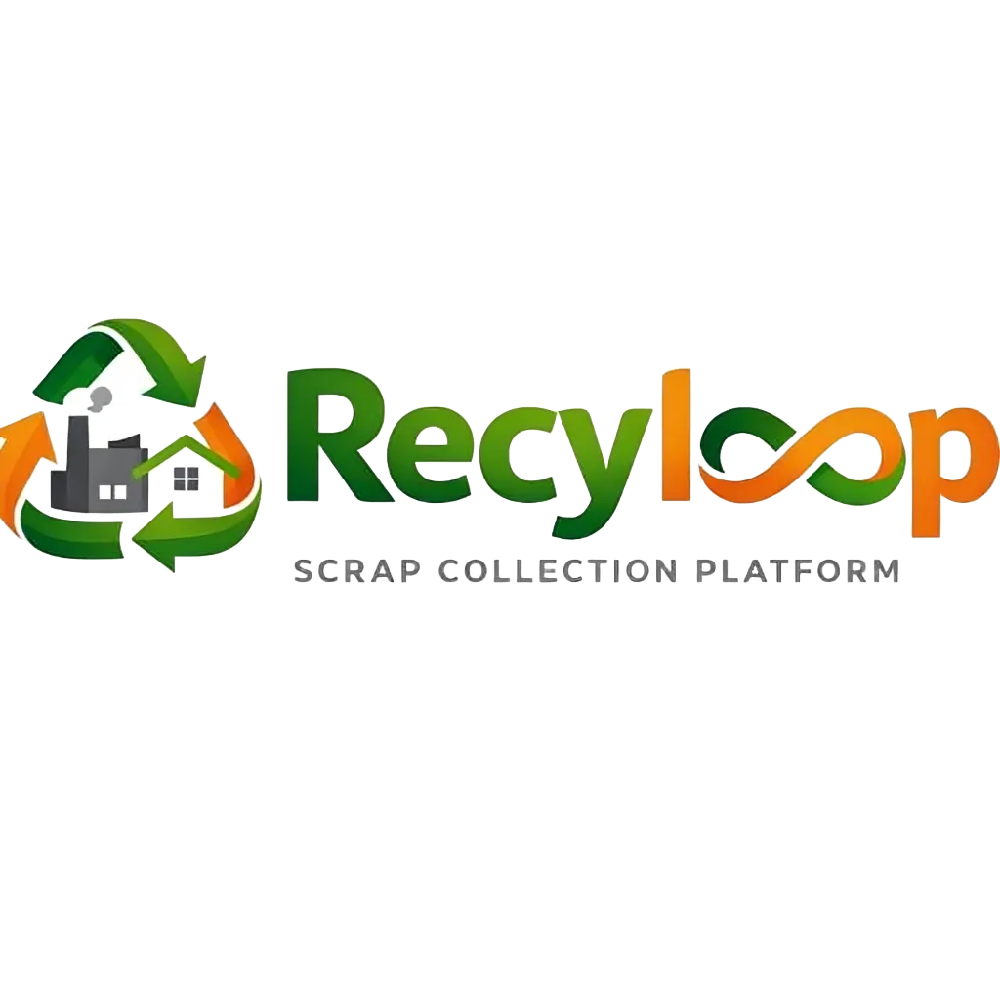

<div align="center">
  
</div>

# Recyloop Frontend Web

## 🚀 Features

Recyloop incorporates a role-based access control system with dedicated dashboards and functionalities for distinct user types:

### 1. System Administrator (`admin`)
- **Global Overview**: Full access to all platform data across all cities.
- **User Management**: Approve pending vendors, create city admins, and delete users.
- **Product Management**: Create and manage recyclable product categories.
- **Global Rates and Supply**: View and manage `Vendor Supply` and `Recycler Demand` statuses and product rates globally.

### 2. City Administrator (`city_admin`)
- **City-Level Dashboard**: A customized dashboard showing only data relevant to the admin's assigned city.
- **Local User Management**: View and approve vendors and recyclers operating strictly within their city.
- **City Supply & Demand**: Track and manage the status (Active/Resolved) and completed orders of Vendor Supplies and Recycler Demands specific to their city.
- **City Rates**: Define and manage the pricing rates for recyclable products specifically for their region.

### 3. Vendor (`vendor`)
- **Vendor Dashboard**: Personal dashboard showing their supply activities.
- **Supply Submission**: Update the system with available recyclable supplies (weight, specific product category).

### 4. Recycler (`recycler`)
- **Recycler Dashboard**: Personal dashboard showing their demand activities.
- **Demand Submission**: Request specific recyclable products (weight, rate offered).

## 🛠️ Technology Stack

- **Framework**: React.js with Vite
- **Routing**: React Router (`react-router-dom`)
- **Styling**: Contextual CSS styles with animated gradients and glassmorphism elements.
- **Icons**: `react-icons` (Feather Icons)
- **API Communication**: Axios (pointed via `services/api.js`)
- **State Management**: React Context (`AuthContext`, `ToastContext`)

## 📦 Getting Started

### Prerequisites
- Node.js (v18 or higher recommended)
- `npm` or `yarn`

### Installation

1. Clone the repository and navigate to the frontend directory:
   ```bash
   cd recyloop/frontend-web
   ```

2. Install dependencies:
   ```bash
   npm install
   ```

3. Configure Environment Variables:
   Create a `.env` file in the root of `frontend-web` and specify the backend API URL  ```env
   ```

4. Run the development server:
   ```bash
   npm run dev
   ```

5. Open your browser and visit:
   `http://localhost:5173`

## 🗂️ Project Structure

- `src/api` - Axios configurations and interceptors.
- `src/components` - Reusable UI components (Modals, Confirm Dialogs).
- `src/context` - React Context providers globally managing Authentication and Toasts.
- `src/pages` - Role-specific pages grouped together:
  - `/Admin` - Main admin views (User, City, Product, Supply/Demand, Rates).
  - `/CityAdmin` - City Administrator specific views.
  - `/Vendor` - Vendor views.
  - `/Recycler` - Recycler views.
  - `/Auth` - Login and registration.
- `src/services` - HTTP methods and endpoints.
